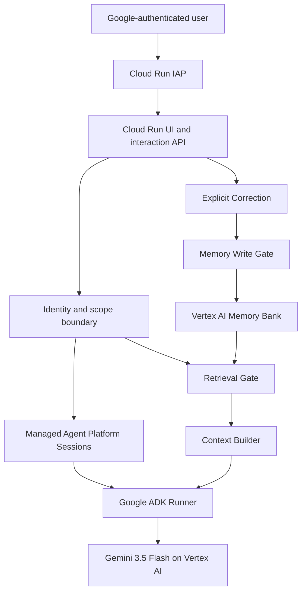

# Adaptive Agent Kernel

Adaptive Agent Kernel (AAK) is a secure, single-agent memory prototype built
for the **Collaborative Partner** category of the All Things Agentic Hackathon.
It demonstrates how an AI partner can retain useful context, retrieve it within
the correct user boundary, adapt its response, and honor explicit corrections
without treating persistent memory as trusted instructions.

AAK uses Google ADK and Gemini 3.5 Flash on Vertex AI, managed Agent Platform
Sessions, native Memory Bank, and an Identity-Aware Proxy (IAP)-protected
Cloud Run interface.

> **MVP status:** The core single-agent workflow is implemented on `main` and a
> bounded Cloud Run deployment has been verified. The evidence and limitations
> in this README are intentionally scoped; AAK is an experimental reference
> kernel, not a general-purpose autonomous platform.

## Project links

- **Hosted interface:** <https://aak-mvp-okccsm7rca-uc.a.run.app>
- **Current implementation evidence:**
  [`docs/codex/PROJECT-STATE.md`](docs/codex/PROJECT-STATE.md)
- **Runtime architecture:**
  [`docs/architecture/CLOUD-RUN-IAP-COMPOSITION.md`](docs/architecture/CLOUD-RUN-IAP-COMPOSITION.md)
- **Memory boundary:**
  [`docs/architecture/MEMORY-BANK-NATIVE-SCOPE.md`](docs/architecture/MEMORY-BANK-NATIVE-SCOPE.md)
- **Security model:** [`docs/security/`](docs/security/)

The hosted interface requires Google authentication through direct Cloud Run
IAP. External judge eligibility depends on the Google Auth Platform audience
being published for external use. See [Hosted access status](#hosted-access-status)
before relying on the URL for judging.

## The problem

Long-running AI collaboration breaks down when an assistant forgets durable
preferences, retrieves irrelevant or cross-user context, or continues using an
outdated belief after the user corrects it. Persisting everything is not a safe
solution: stored content can be stale, sensitive, incorrectly scoped, or
adversarial.

AAK explores a narrower question:

> Can a single agent become more useful over time while identity, memory writes,
> retrieval, and corrections remain explicit application-controlled boundaries?

## What the MVP demonstrates

| Behavior | Demonstrated outcome |
|---|---|
| Cold Start | The agent responds without inventing prior memory when none is available. |
| Recall | The agent can retrieve persisted context from the authenticated user's native Memory Bank scope. |
| Relevance | Retrieval is bounded to `top_k=2`; only a structurally valid provider-ranked first result is admitted. |
| Adaptation | Retrieved context is labeled as untrusted data and can influence the current response without becoming policy. |
| Correction | An explicit typed correction passes through the Memory Write Gate so newer user direction can supersede stale context. |

These are bounded executable scenarios. They do not establish universal
semantic relevance, provider-wide correction guarantees, or production-scale
reliability.

## How it works



The browser cannot choose `user_id`, memory scope, Google Cloud project,
runtime ID, or provider coordinates. Direct IAP authenticates the user; AAK
verifies the signed assertion and derives identity from its verified subject.
The server supplies the AAK scope.

Retrieved memory is always treated as `UNTRUSTED_DATA`. It may contribute
context, but it cannot replace application policy or authorize an operation.
Every supported persistent-memory mutation passes through the Memory Write
Gate.

## Technology stack

| Layer | Technology | Role |
|---|---|---|
| Model | Gemini 3.5 Flash | Adaptive response generation through Vertex AI |
| Agent framework | Google ADK 2.8.0 | Agent, application, and provider-backed runner |
| Compute | Google Cloud Run | Authenticated browser and HTTP runtime |
| Session state | Vertex AI Agent Platform Sessions | Managed session creation and restoration |
| Long-term memory | Vertex AI Memory Bank | Native scoped persistent memory |
| Authentication | Direct Cloud Run IAP | Google authentication and signed identity assertion |
| HTTP application | FastAPI and Uvicorn | Same-origin UI, health check, and interaction API |
| Dependency management | `uv` with `uv.lock` | Locked, reproducible Python environment |

## Security design

AAK separates model reasoning from security authority:

- authenticated identity and server-controlled scope determine session and
  memory access;
- the interaction request accepts only `request`, optional `session_id`, and
  optional `correction`;
- unknown fields and malformed input fail closed at the HTTP boundary;
- request-validation evidence is sanitized and excludes rejected user values;
- session history and retrieved memory remain untrusted data;
- supported writes pass through the Memory Write Gate;
- retrieval is bounded by exact authenticated scope and application policy;
- secrets, assertions, tokens, prompts, and memory payloads are not intended
  for ordinary logs.

AAK does not expose consequential tools in this MVP. A deterministic Tool
Policy Broker, complete output/egress gate, and Audit/Decision Ledger remain
outside the completed judge-facing slice.

## Reproduce the project

### Prerequisites

- Git
- Python 3.14.x (the repository pins Python 3.14.7)
- `uv` 0.12.5
- Linux, macOS, or WSL for the commands below

### 1. Clone the repository

```bash
git clone https://github.com/JMG3000/Adaptive-Agent-Kernel.git
cd Adaptive-Agent-Kernel
```

This repository is private at the current checkpoint. The clone command
requires an authorized GitHub account.

### 2. Install the tested `uv` release

This installation does not modify the shell profile:

```bash
curl -LsSf https://astral.sh/uv/0.12.5/install.sh \
  | env UV_INSTALL_DIR="$HOME/.local/bin" UV_NO_MODIFY_PATH=1 sh
export PATH="$HOME/.local/bin:$PATH"
uv --version
```

Expected version:

```text
uv 0.12.5
```

### 3. Create the locked environment

```bash
uv sync --locked
```

This creates `.venv` from `pyproject.toml` and `uv.lock` without updating the
lockfile.

### 4. Run the deterministic regression suite

```bash
.venv/bin/python -m unittest \
  tests.test_identity_session \
  tests.test_memory_write_gate \
  tests.test_adk_foundation \
  tests.test_managed_sessions \
  tests.test_memory_bank_provider \
  tests.test_adaptive_recall \
  tests.test_correction \
  tests.test_cloud_run \
  -v
```

A successful run ends with `OK`. The recorded completed-MVP checkpoint passed
68 tests. Current `main` also contains two input-boundary regression tests added
after that checkpoint; network, model, and provider boundaries remain faked in
the local suite, so local success is not proof of live Google Cloud behavior.

### 5. Start the local HTTP surface

The root page and health endpoint are intentionally provider-independent:

```bash
PORT=8080 .venv/bin/python -m aak.cloud_run
```

In another terminal:

```bash
curl --fail http://127.0.0.1:8080/healthz
```

Expected response:

```json
{"status":"ok"}
```

Open <http://127.0.0.1:8080/> to inspect the browser UI. A local page load is
not an authentication bypass; successful interactions require a verified
Google identity, valid Application Default Credentials, and live provider
configuration.

### Optional: verify the container image

Docker or Podman can build the repository-owned production image:

```bash
docker build -t aak-mvp:local .
docker run --rm -p 8080:8080 aak-mvp:local
```

Then repeat the `/healthz` request above. Provider-backed interactions require
the configuration and credentials described in the next section.

## Live provider configuration

The following environment variables are required before an interaction. They
are not required for `/` or `/healthz`.

| Variable | Purpose |
|---|---|
| `GOOGLE_CLOUD_PROJECT` | Google Cloud project containing the runtime |
| `VERTEX_MODEL_LOCATION` | Vertex AI model location |
| `AGENT_PLATFORM_LOCATION` | Agent Platform Sessions and Memory Bank location |
| `AGENT_RUNTIME_ID` | Agent Platform runtime resource ID |
| `AAK_OIDC_AUDIENCE` | Accepted Google bearer-token audience for controlled local proof |
| `AAK_IAP_AUDIENCE` | Exact deployed IAP resource audience |
| `AAK_SCOPE` | Server-controlled application scope |

Use Application Default Credentials or a least-privilege runtime service
identity. Do not place credentials, tokens, private keys, or OAuth secrets in
the repository, `.env` files committed to Git, command history, screenshots,
or issue reports.

The deployed non-secret coordinates are:

```text
Google Cloud project:       adaptive-agent-kernel-v1-hack
Cloud Run service/region:   aak-mvp / us-central1
Vertex model location:      us
Agent Platform location:    us
Agent Platform Runtime ID:  3642145461147533312
AAK server scope:           aak-mvp
Gemini model:               gemini-3.5-flash
```

## Deployment evidence

The bounded deployment record for 2026-08-31 is:

| Evidence | Verified value |
|---|---|
| Source checkpoint | `8abe06a976609b2e5b3cfec62dde4a746b23f3bd` |
| Cloud Run service | `aak-mvp` in `us-central1` |
| Ready revision | `aak-mvp-iap8abe06a` |
| Image digest | `sha256:c23e1f34ecf90ccba521328c4017b497782296458196fccfa4f8885678ff59b2` |
| Runtime identity | Dedicated service account with `roles/aiplatform.user` |
| Controlled browser proof | UI load, successful Gemini interaction, same-session continuation, and New Session |

Current `main` includes the later input-normalization change at
`19f101f14bfd9f3b20ecf8f5e3dc6d301276571f`. This README does not claim that
the later source revision is the deployed image until deployment evidence is
updated.

## Hosted access status

One controlled authenticated browser proof succeeded against the IAP-protected
service. An independent external tester reached the page but did not complete
an interaction before the current input-normalization fix. The available
read-only evidence also did not expose the Google Auth Platform publishing
status.

Before relying on the hosted URL for judging:

1. confirm Google Auth Platform **Audience** is **In production**;
2. deploy the intended final source revision;
3. verify the deployed revision and image digest;
4. repeat interaction, same-session continuation, New Session, and correction
   with an external eligible test account; and
5. record the result without capturing credentials, tokens, assertions, or
   private test data.

Until those checks pass, the hosted URL is evidence of a bounded deployment,
not a claim of unrestricted external access.

## Repository structure

```text
aak/                    Application, session, memory, correction, and runtime code
tests/                  Deterministic regression and security-boundary tests
docs/architecture/      Implemented composition and memory-scope decisions
docs/codex/             Current implementation and evidence ledger
docs/engineering/       Development and verification practices
docs/research/          Platform findings and provenance
docs/security/          Threat model, security architecture, and test plan
Dockerfile              Reproducible Cloud Run image
pyproject.toml           Direct dependency contract
uv.lock                  Locked dependency graph
```

## Scope and limitations

AAK is intentionally not a multi-agent fleet, A2A system, central orchestration
hub, or generalized autonomous workflow engine. The MVP does not claim:

- universal semantic relevance or correction behavior;
- universal session restoration across every provider/runtime failure;
- unrestricted external OAuth eligibility;
- production-scale availability or performance;
- a complete Tool Policy Broker, output/egress gate, or Audit/Decision Ledger;
- multi-agent, A2A, MCP runtime, or high-risk tool execution.

This narrow scope keeps the submission aligned with what the implementation and
recorded evidence actually demonstrate.
